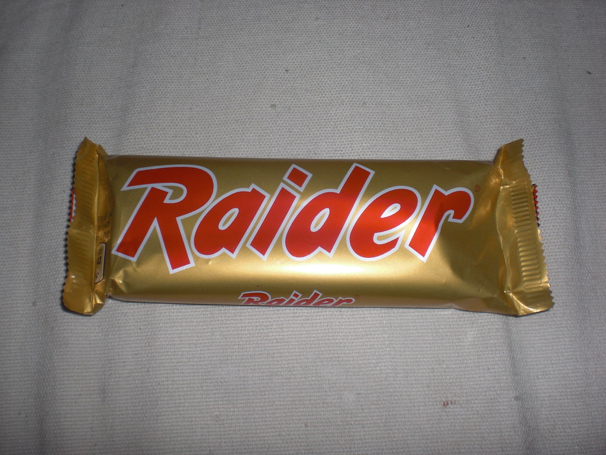

# he went to the old school

The URL for this level reads :

```
https://www.deathball.net/notpron/sdrawkcab/tieman.htm
```

Those last two words are backwards. They read : `backwards` and `nameit`.

Two HTML comments give us more insight :

```
<!-- times have changed in deutschland -->
<!--what candy wrapper is it?-->
```

We need to find the name of this candy bar. We know it's red and gold, and the deutschland comment suggests German candy.

An image search for `german twix` yields us exactly what we're looking for :



We try replacing `nameit` with `raider` in the url, but we get `dnuorayawrehto` (`otherwayaround` backwards).

Almost there ! We replace `nameit` with `raider` backwards :

```
https://www.deathball.net/notpron/sdrawkcab/rediar.htm
```

It works ! We can move on to level 8.